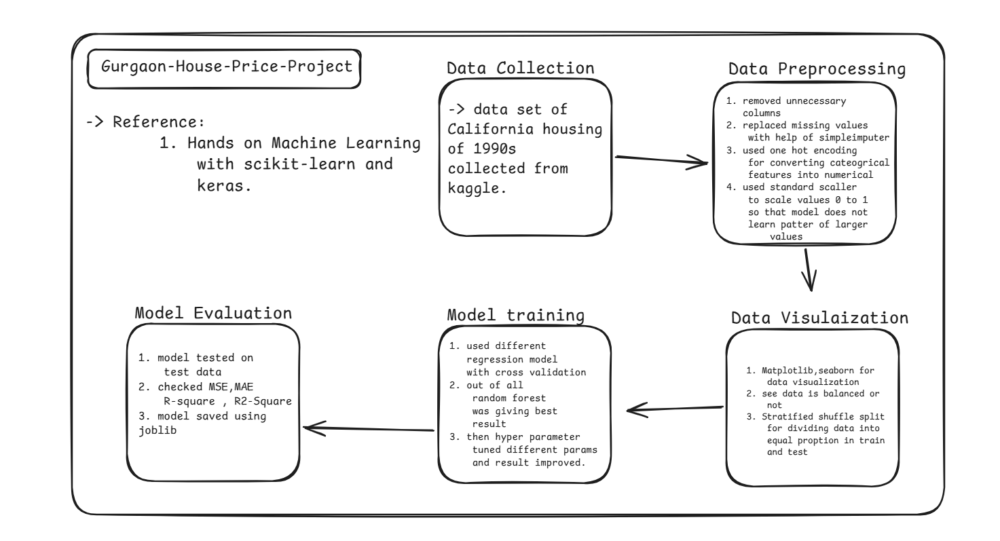

#🏡 Gurgaon Housing Price Prediction

This project focuses on predicting Gurgaon house values which is based on the 1990s California housing dataset. The prediction is based on various factors such as location, demographics, and housing attributes.

Among different machine learning models tested, the Random Forest Regressor gave the best accuracy, making it the final choice for this project.

---
# Project Work flow

---

#📌 Project Overview

📂 Dataset: California housing data (1990s)

🔎 Goal: Predict house prices based on multiple features

⚙️ Tech stack: Python, NumPy, Pandas, Scikit-learn, Joblib, Matplotlib/Seaborn (for analysis & visualization)

🤖 Best Model: Random Forest Regressor (highest accuracy among tested models)

#🚀 Features

Data preprocessing & cleaning

Exploratory data analysis (EDA) with visualizations

Training & evaluation of multiple regression models

Hyperparameter tuning for better performance

Saving and loading trained models using Joblib

Final prediction using Random Forest

